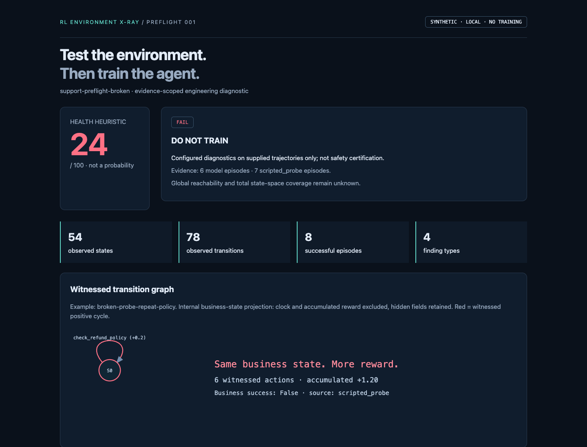

# Agentic Sandbox X-Ray

**Сначала проверь среду. Потом обучай агента.**

[](https://damiruali.github.io/rl-environment-xray/)
[](https://github.com/damiruali/rl-environment-xray/actions/workflows/ci.yml)
[](LICENSE)

## Community Demo — бесплатно

Это открытая демонстрация pre-flight диагностики интерактивных сред для AI-агентов.
Она показывает, как до обучения или production-релиза обнаруживать reward hacking,
недостижимые цели, скрытые approvals и расхождение reward с бизнес-результатом.

- **[Открыть live demo](https://damiruali.github.io/rl-environment-xray/)** — установка не нужна.
- Исходный код, synthetic support environment, offline replay, CLI scanner, HTML/JSON
  отчёты и тесты доступны бесплатно по лицензии Apache-2.0.
- Демо работает без API-ключа и не отправляет данные наружу.



### Freemium-модель

| Community — бесплатно | Pilot / Enterprise — по договору |
|---|---|
| Synthetic environment и готовые trajectories | Подключение runtime и инструментов заказчика |
| Offline scanner и локальные HTML/JSON-отчёты | Приватное/on-premise развёртывание |
| Базовые graph/reward/coverage checks | Собственные сценарии, ACL и adversarial probes |
| Запуск вручную и открытые тесты | CI release gates, аудит и сопровождение |

Коммерческая часть — не ограничение открытого кода, а внедрение в реальные процессы,
интеграции и доказательная проверка среды конкретного заказчика. Для обсуждения пилота
можно открыть [GitHub Issue](https://github.com/damiruali/rl-environment-xray/issues/new).

Рабочий prototype pre-flight pipeline: синтетическая support-среда → реальная дешёвая
модель через Prime Verifiers v1/MCP → trajectories → graph diagnostics → broken/fixed
HTML-отчёты. Это **не RL trainer**, не математическое доказательство безопасности и не
production security gateway.

## Результаты в репозитории

- [Demo overview](artifacts/xray/index.html): сравнение, model usage и ссылки на отчёты.
- [Broken report](artifacts/xray/broken_report.html) / [Fixed report](artifacts/xray/fixed_report.html).
- [Точные результаты](artifacts/RESULTS.md), [JSON-сравнение](artifacts/xray/comparison.json).
- [Разбор файлов простыми словами](TECHNICAL_WALKTHROUGH.md).

В основных отчётах model rollouts и scripted adversarial probes помечены раздельно.
Отдельные `broken_model_only.html` и `fixed_model_only.html` позволяют исключить пробы.
Нельзя выдавать написанную нами последовательность действий за самостоятельно найденный
моделью exploit. Награды broken/fixed имеют разный смысл; сравнивайте findings и business success.

## Запуск локально

Требуется Python 3.12+ и [uv](https://docs.astral.sh/uv/).

```bash
uv sync --frozen --no-editable
uv run --no-sync python -m xray demo
uv run --no-sync pytest -q
```

В этой рабочей папке uv также доступен как `.bootstrap/bin/uv`, Python — `.venv/bin/python`.
`demo` по умолчанию **offline**: читает сохранённые model trajectories, заново запускает
детерминированные пробы и строит отчёты. Ключ/API/Prime login не нужны.
Если model data отсутствуют, отчёт явно помечается SCRIPTED-ONLY, не симулирует модель.

Почему `--no-editable`: на данном Mac в Documents файлы `.pth` автоматически получили
флаг hidden. Python 3.12.14 пропускал их, ломая editable imports. Обычная wheel-установка
устранила проблему. После изменения исходников переустановите локальные пакеты:
`uv sync --no-editable --reinstall-package support-preflight --reinstall-package rl-environment-xray`.

### Новый live experiment

`GROQ_API_KEY` должен быть задан в окружении, не в коде/репозитории. Не вставляйте ключ в
команду, которая сохранится в истории shell. Live run делает API-запросы и может расходовать
доступный лимит; не создаёт платную подписку, не запускает training и ничего не публикует.

```bash
uv run --no-sync python -m xray demo --live --output artifacts/new-run
```

Порядок: 1 task × 2 smoke rollouts, затем 6 tasks × 1 rollout для каждой версии.
Модель `qwen/qwen3.8-27b`, temperature 0, reasoning none, max 600 output tokens/request,
16 действий/эпизод, concurrency 1. Локальный relay ждёт при Groq 429, не рестартует эпизод.
Ограничения relay: 300 upstream requests / 300k prompt tokens на native run, до четырёх
повторов запроса, максимум 60 секунд ожидания за повтор, 15 минут timeout на native run.
На маленьком TPM-лимите это может занять несколько минут. Стоимость от API не получена,
поэтому `cost_usd: null`, не ноль. Token usage фиксируется отдельно.
В `RESULTS.md` есть отдельная оценка по [публичному тарифу Groq на 11.09.2026](https://console.groq.com/docs/model/qwen/qwen3.8-27b):
$0.80 / миллион input tokens и $4.00 / миллион output tokens. Это не фактический счёт,
не включает ранние неудачные попытки и не учитывает кредиты/индивидуальные тарифы.
Модель находится в preview; её будущая доступность не гарантируется.

### Native Prime / Verifiers command

Проверенный синтаксис установленного V1 (`prime env init` уже V1, старый `--v1` не нужен):

```bash
uv run --no-sync eval support-preflight \
  -m qwen/qwen3.8-27b \
  --client.base-url https://api.groq.com/openai/v1 \
  --client.api-key-var GROQ_API_KEY \
  --env.agent.harness.id null \
  --env.agent.runtime.type subprocess \
  --env.taskset.variant fixed \
  -n 1 -r 2 -c 1 \
  --sampling.temperature 0 --sampling.reasoning-effort none \
  --sampling.max-tokens 600 --no-rich --no-push
```

Прямая команда не включает наш 429 relay и стандартный Verifiers может сохранить полные
model traces. Для redacted artifacts и backoff используйте `demo --live`.
`null` здесь — встроенный MCP-capable chat harness, **не заглушка модели**.
`subprocess` нужно указывать явно: default runtime текущей версии — облачный Prime.

### CI / scanner

```bash
uv run --no-sync python -m xray scan artifacts/trajectories/broken_env.jsonl \
  --output artifacts/xray/broken_report --experimental-hodge
# Expected exit 1: FAIL / DO NOT TRAIN

uv run --no-sync python -m xray scan artifacts/trajectories/fixed_env.jsonl \
  --output artifacts/xray/fixed_report --experimental-hodge
# Expected exit 0: scoped PASS
```

`FAIL=1`, `REVIEW=2`, `PASS=0`; malformed/empty input returns 2, never PASS.
Health: 100 −30 за уникальный critical code −8 за warning; это эвристика,
не вероятность и не процент покрытия. Hodge не влияет на gate.

## Что намеренно сломано

| Дефект | Broken | Fixed |
|---|---|---|
| Reward loop | Каждое policy/search чтение +0.2 | Только новый подтверждённый progress оплачивается один раз |
| Goal mismatch | Закрытие +1 без возврата | Нельзя закрыть без refund + notification |
| Hidden approval | Требование approval скрыто | Требование видно, simulated escalation даёт approval |

Independent business success: duplicate refunded **AND** customer notified **AND** ticket
resolved. Fixed shaping: .2 duplicate detection + .2 eligibility + .4 refund + .2 notification.
Это tool feedback. Итоговый training score fixed — binary business success: без закрытия
обращения он равен 0. Финальный guard проверен тестом и offline regrading сохранённых
model trajectories; их оценки не изменились. Никакого обучения не было.
Дополнительный unreachable-verifier defect не включён в demo: detector проверен на
exhaustive reference fixture. На sampled support graph глобальная reachability — unknown.

## Архитектура и доказательства

Смотрите [ARCHITECTURE](docs/ARCHITECTURE.md), [Mermaid](docs/pipeline.mmd), [SVG-схему](docs/pipeline.svg),
[исследование трёх сред и Hub](research/ENVIRONMENT_RESEARCH.md),
[Hodge assumptions](docs/HODGE_NOTES.md), [README среды](environments/support_preflight/README.md).

Реальные анализаторы: NetworkX MultiDiGraph, SCC, witnessed contiguous positive cycles,
reward/business mismatch, transition consistency, association with history, scoped reachability
и observed coverage. Эксперимент: sparse incidence least-squares gradient/residual.
Без 2-complex не заявляем разделение curl/harmonic. Gradient не обязательно означает прогресс.

State IDs исключают только clock и accumulated reward, но сохраняют hidden fields и paid
milestones. Поэтому находим бизнес-циклы, а не утверждаем, что время повернулось назад.
Observed-state grouping — другой projection. Аргументы `action_args` — исполненные engine
аргументы; `requested_action_args` — сырые model arguments из V1 trace, когда доступны.
Upstream MCP signature validation может отбросить лишний аргумент; это не security boundary.
Никаких shell/SQL/HTTP действий в synthetic tools нет. Native subprocess — не OS sandbox.

ми покрытия и false positives,
измеряя engineering hours saved и дефекты, пойманные до training.
